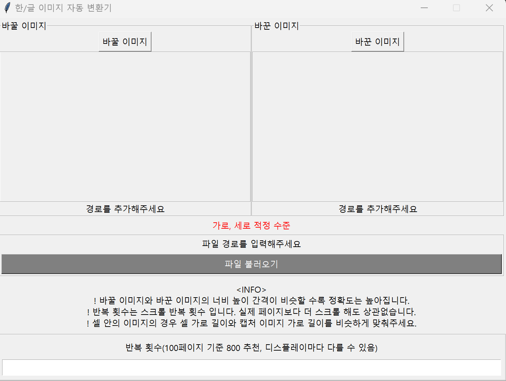

## 1.계기

한/글 문서에는 글자를 한번에 바꿔주는 기능은 있으나, 한번에 그림을 바꾸진 못합니다.

마침 pyautogui의 locateOnScreen 함수를 이용하면 이를 보완하는 것이 가능할 것 같았습니다.


<br/>


## 2.설계

처음보는 누구나 사용할 수 있도록 파이썬 내장 모듈인 tkinter와 PIL인 pillow를 이용해서 GUI 형식으로 만들었습니다.

한/글 문서의 한번에 바꾸기에서 바꿀 글자와 바꾼 글자를 입력해야 하듯이 GUI내에서도 바꿀 이미지와 바꾼이미지를 입력받습니다.


<br/>


### 캡처 도구의 이용

이미지는 가지고 있는 노트북 혹은 컴퓨터의 모니터 크기에 따라 크기가 달라집니다. 또한 한/글 문서의 확대 수준에 따라서도 바뀝니다. 이는 이미지를 인식하는데 있어 정확도를 감소시킵니다.


<br/>

따라서 윈도우에 내장되어 있는 캡처도구를 통해 이미지의 규격을 각 기기마다 통일 시켜야합니다. 뿐만 아니라 셀 안의 이미지를 삽입하는 경우, 사진이 한쪽으로 쏠리기도 합니다. 번거롭지만 이미지의 가로/세로 크기를 셀 가로/세로 크기와 일치시키는 것이 이미지 정렬에 있어 유리해집니다.

<br/>


코드에 삽입되는 이미지 규격과 이미지 인식, 삽입 간의 정확성은 이 프로그램에 있어 굉장히 중요합니다. 결론은 다음과 같은 사항을 만족시켜주어야 하죠.

<br/>


* 바꿀 이미지와 바꾼 이미지의 규격이 거의 동일해야 합니다.

* 이미지의 규격은 유동적으로 설정해야합니다.(셀 안에 있는 경우 셀 크기에 맞춰야 정렬)


<br/>

## 3. 구현

이미지 조건이 충족된다면, 나머지 구현은 평탄하게 진행됩니다. pyautogui의 이미지 인식, 클릭, 삭제, 붙여넣기만 구현하면 됩니다.

이미지를 클립보드에 복사하는 것은 다음과 같이 이미지를 RGB데이터로 변환 시킨 후 클립보드로 복사합니다.

<br/>


### 이미지 받아서 클립보드 복사

```python
filepath = 'after.png'
image = Image.open(filepath)
output = BytesIO()
image.convert("RGB").save(output, "BMP")
data = output.getvalue()[14:]
output.close()
send_to_clipboard(win32clipboard.CF_DIB, data)
```

<br/>


## 4. 결과 및 개선할 점



전반적인 GUI는 위와 같습니다. 가로/세로 규격이 일정 기준 이상 맞지 않는다면 '적정 수준 입니다'라는 텍스트가 바뀝니다.


스크롤 속도의 경우, 코드 상 임의로 수정해서 사용할 수 있습니다. 캡처도구를 이용했을 때 제일 이미지 인식 정확도가 좋은 것 같군요


<br/>


단, 무한 스크롤에 대한 방법은 셀레니움이나 BeautifulSoup와 같은 크롤링 도구와는 다르게 찾기 어려웠습니다. 그래서 사용자가 직접 고려해서 몇 번 스크롤을 내릴지 판단해야합니다. 화면 규격에 따라 스크롤 정도가 다르니 절대적인 기준을 세우기 어려웠습니다.. 🤔

<br/>


또한 한 페이지 당 여러 이미지를 인식하는 것도 수정할 점인 것 같습니다. 이는 locateAllOnScreen을 통해 수정 가능할 듯 싶군요.


<br/>

## 5. 소감

pyautogui, tkinter, pillow 등을 한번 직접 사용하면서, 뭐든 한번씩 만져보는게 중요한 것 같습니다. 또한 이러한 모듈을 사용할 때, 데이터를 가공하는 과정이 프로그램의 성능을 좌우짓는다는 걸 더욱 체감하게 되었습니다.


```toc

```

